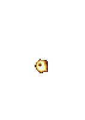

# twinkpup

a silly little web forum

## Prerequisites
This project requires the following installed on your development computer:
* [Docker](https://docs.docker.com/engine/install/)
* [Bun](https://bun.com/docs/installation)

## Installation

Clone the repository to your computer
```sh
git clone https://github.com/lexifuzzpup/twinkpup.git
```

## Development
Start the compose stack
```sh
bun run dev
```

## Deployment

To do the latter steps, the image must be built first:
```sh
docker build -t twinkpup .
```

### Single container
To run it using Docker CLI, use the following command:
```sh
docker run -p 3000:3000 -v ./run:/data twinkpup
```

### Compose stack
Create a compose file with the following:
```yaml
services:
  twinkpup:
    image: twinkpup
    ports:
      - 3000:3000
    volumes:
      - ./run:/data
```

## Configuration
The image takes the following environment variables:

* **SQLITE_DB_FILE**: location inside the container to write the sqlite db to. Default `/data/db.sqlite`.
* **NODE_ENV**: set the environment for `development` or `production`. Defaults to development environment.